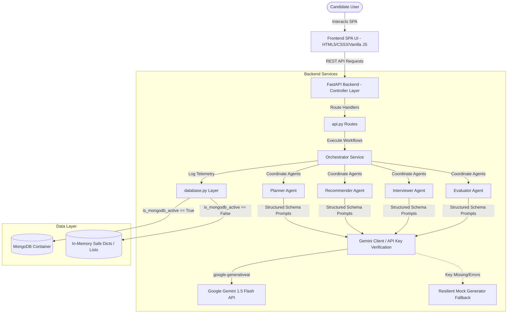

# Placement Preparation Agent (PrepAgent AI)

Placement Preparation Agent is a premium, production-ready, full-stack application built to accelerate career preparation. Guided by a multi-agent orchestration system and powered by Google Gemini, the platform dynamically designs study schedules, curates coding challenges, simulates realistic mock interviews, and evaluates answers.

## 🚀 Architecture Design

The application adheres to a clean REST API MVC design with an autonomous Multi-Agent orchestration layer, structured telemetry logging, and a resilient dual-mode database access repository.



### Key Architectural Concepts
1. **Model-View-Controller (MVC)**:
   - **View**: A glassmorphic SPA frontend serving semantic layouts and dynamic JS chart components.
   - **Controller**: FastAPI endpoints parsing incoming request payloads and dispatching to services.
   - **Model**: Pydantic validations structuring requests and strictly typing agent responses.
2. **Dual-Mode Repository Pattern**:
   - Connection attempts check if MongoDB (`MONGO_URI`) is running. If it times out or is unconfigured, it logs a warning and routes queries to local collections (`IN_MEMORY_SESSIONS`, `IN_MEMORY_LOGS`, `IN_MEMORY_HISTORY`). The app remains fully functional.
3. **Structured Gemini Schema Engine**:
   - Enforces outputs matching JSON Pydantic contracts utilizing `response_schema` generation configs to avoid markdown wrap formatting errors.

---

## 🛠 Technology Stack
- **Backend**: Python 3.12, FastAPI, Uvicorn
- **Frontend**: HTML5, CSS3 (Vanilla Glassmorphic styling), Vanilla JavaScript, Chart.js, Lucide Icons
- **Database**: MongoDB (via Motor Async Driver) / Memory fallback arrays
- **LLM Integration**: Google Gemini API via `google-generativeai` (`gemini-1.5-flash`)
- **Deployment**: Docker & Docker Compose

---

## ⚙️ Environment Configuration

Create a `.env` file in the project root (copied from `.env.example`):
```env
GEMINI_API_KEY=YOUR_GEMINI_API_KEY
MONGO_URI=mongodb://mongodb:27017/placement_db
PORT=8000
HOST=0.0.0.0
```
> [!NOTE]
> If `GEMINI_API_KEY` is omitted, the app will boot in Offline Mock Mode, generating realistic mock JSON payloads so you can demo the dashboard and mock interview chat without APIs.
> If `MONGO_URI` is omitted or database is down, the app boots in In-Memory Mode.

---

## 🤖 Multi-Agent Specifications

Each Agent enforces strict prompt instructions to guarantee Gemini returns an unencapsulated JSON response.

| Agent Name | Function | Pydantic Response Schema |
| :--- | :--- | :--- |
| **Planner Agent** | Designs a 7-day study curriculum tailored to a role, skill level, and prep time. | `StudyPlan` |
| **Recommender Agent** | Curates exactly 3 coding challenges matching a role and target difficulty. | `CodingArenaRecommendations` |
| **Interviewer Agent**| Initiates a mock simulation generating technical/behavioral questions and hints. | `InterviewQuestion` |
| **Evaluator Agent** | Critically grades candidate answers, lists strengths/weaknesses, and offers tips. | `EvaluationResult` |

---

## 🔌 API Documentation

| Endpoint | Method | Request Payload | Response Data |
| :--- | :--- | :--- | :--- |
| `/api/generate-study-plan` | `POST` | `{ "role": "str", "skill_level": "str", "hours_per_day": float, "target_date": "str/null" }` | Structured study plan JSON containing days, topics, tasks, and revision. |
| `/api/recommend-problems` | `POST` | `{ "role": "str", "level": "Easy/Medium/Hard" }` | Array of 3 challenges with title, difficulty, description, and recommendation reason. |
| `/api/start-interview` | `POST` | `{ "role": "str", "type": "tech/hr" }` | Session details containing `session_id` and the initial interviewer `question`. |
| `/api/submit-answer` | `POST` | `{ "session_id": "str", "answer": "str" }` | AI Performance report: `score` (1-10), list of strengths, weaknesses, tips, and `next_difficulty`. |
| `/api/request-hint` | `POST` | `{ "session_id": "str" }` | Guidance hint string for the current question. |
| `/api/dashboard` | `GET` | *None* | Metric counters and list structures for Line and Radar Chart plotting. |
| `/api/history` | `GET` | *None* | Chronological logs of completed study plans, problem sets, and interviews. |
| `/api/agent-logs` | `GET` | *None* | Chronological list of agent execution states (input payloads, output responses, errors). |

---

## 🏃 Setup & Run Guidelines

### Method A: Docker & Docker Compose (Recommended)
This runs the complete, production-ready environment including MongoDB.

1. Ensure Docker is installed on your host.
2. Edit the `.env` file and replace `YOUR_GEMINI_API_KEY` with your actual key.
3. Launch the container orchestration:
   ```bash
   docker-compose up --build
   ```
4. Access the dashboard UI at: [http://localhost:8000](http://localhost:8000)

---

### Method B: Local Python Development
1. Create a Python 3.12 virtual environment and activate it:
   ```bash
   python -m venv venv
   # On Windows:
   .\venv\Scripts\activate
   # On macOS/Linux:
   source venv/bin/activate
   ```
2. Install the required libraries:
   ```bash
   pip install -r requirements.txt
   ```
3. Start the FastAPI development server:
   ```bash
   uvicorn backend.main:app --reload --host 0.0.0.0 --port 8000
   ```
4. Open your web browser at: [http://localhost:8000](http://localhost:8000)

---

## 🧪 Verification Protocol
1. **Local Boot Check**: Run the app locally to verify successful parsing of imports.
2. **Dashboard Render**: Verify that counters display zeros (or loaded database state) and Chart.js draws the cadence line and skill radar elements.
3. **Study Planner Creation**: Navigate to Study Planner, type a role, and click generate. Ensure the grid renders 7 cards.
4. **Coding Arena Curation**: Request Medium coding problems for "Frontend Engineer". Verify badges style as green (easy), orange (medium), or red (hard).
5. **Interview Simulation**: Start a technical mock interview. Request a hint and verify it appends to the conversation. Type an answer, submit, and verify the performance report pops up with scores.
6. **Telemetry Streams**: Go to "Agent Activity Log" and verify logs are recorded with expandable JSON trees.
